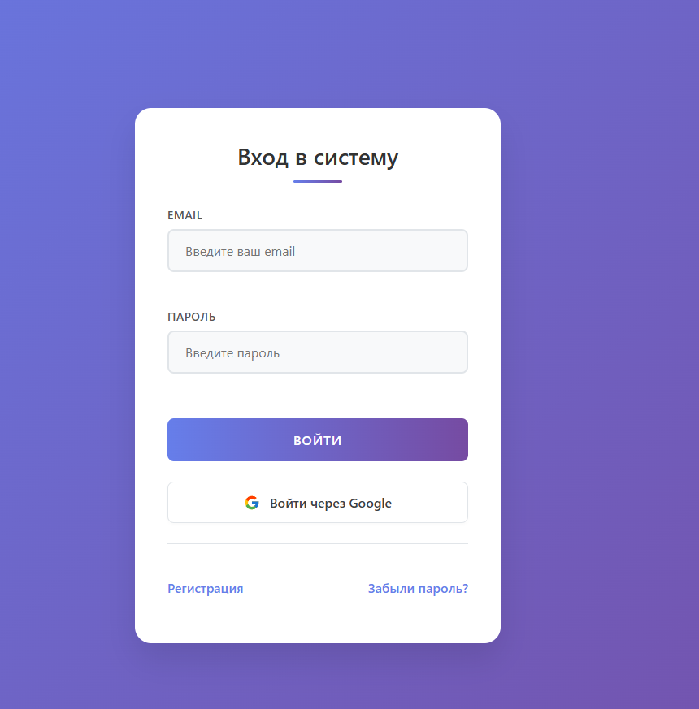
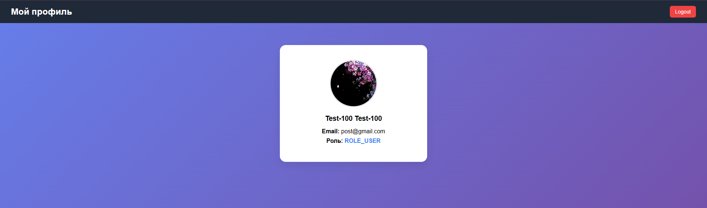
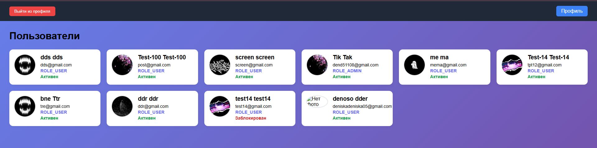
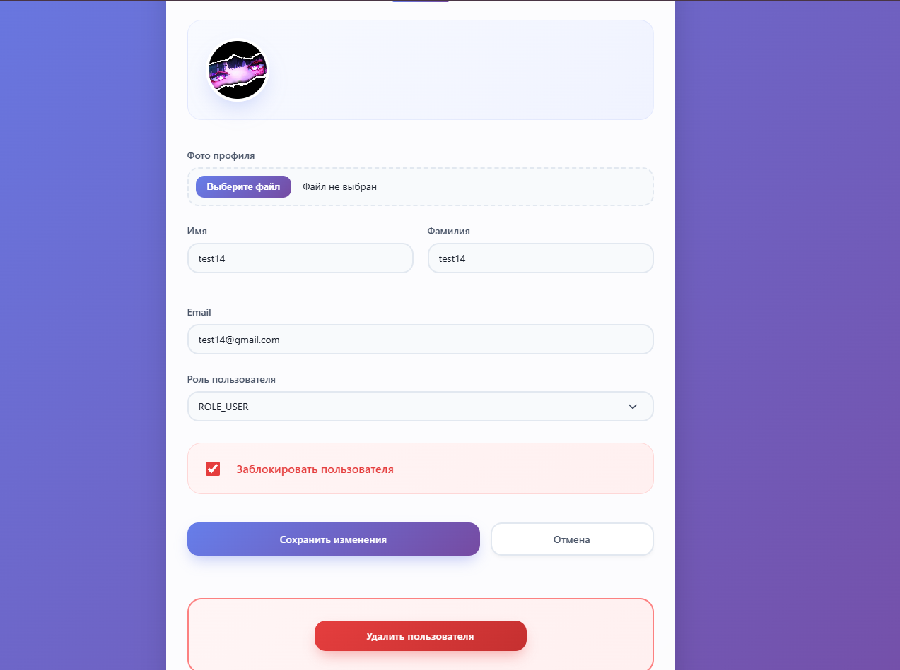
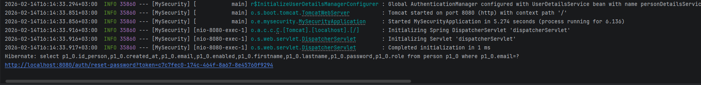

# MySecurity (Spring Boot приложение с локальной аутентификацией и OAuth2)

## Описание
MySecurity - это Spring Boot приложение, которое реализует локальную аутентификацию и поддержку OAuth2 для обеспечения безопасности. Приложение позволяет пользователям регистрироваться, входить в систему и использовать OAuth2 для авторизации через сторонние сервисы.

## Функциональность
- Регистрация пользователей с помощью электронной почты и пароля.
- Вход в систему с использованием локальной аутентификации.
- Поддержка OAuth2 для авторизации через разные сервисы (Google и т.д.)
- Защита маршрутов и ресурсов с помощью Spring Security.
- Реализация token во время смены пароля
- Реализация ролей и небольшой панели администратора для управления пользователями и ролями.

## Основные эндпоинты (из конфигурации безопасности)
- GET /auth/login — страница логина (публично)
- POST /process_login — обработчик формы логина
- GET /auth/register — страница регистрации (публично)
- GET /auth/forgot-password, /auth/reset-password — публичные страницы восстановления пароля
- GET /home — доступно авторизованным пользователям
- GET /home/admin/** — доступно только пользователям с ролью ADMIN

## Пример
### Форма для входа

### Отображение профиля

### Панель управления пользователями (для администраторов)

### Смена пароля ссылка приходит как на email, так в консоль
